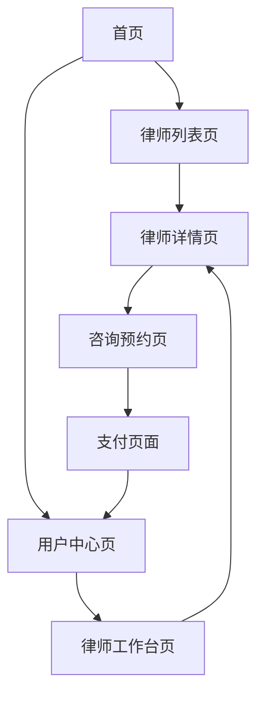

# 律师咨询网站产品需求文档

## 1. 产品概述

律师咨询网站是一个连接用户与专业律师的在线平台，用户可以浏览律师信息、选择合适的律师并进行付费咨询。

该平台解决了用户寻找专业律师困难、咨询成本高、沟通不便等问题，为用户提供便捷、透明、高效的法律咨询服务。

目标是打造一个值得信赖的法律服务平台，提升法律服务的可及性和用户体验。

## 2. 核心功能

### 2.1 用户角色

| 角色 | 注册方式 | 核心权限 |
|------|----------|----------|
| 普通用户 | 手机号/邮箱注册 | 浏览律师信息、预约咨询、付费咨询、评价律师 |
| 律师用户 | 资质审核注册 | 管理个人资料、接受咨询预约、提供咨询服务、查看收益 |

### 2.2 功能模块

我们的律师咨询网站包含以下主要页面：

1. **首页**：平台介绍、律师推荐、搜索入口、用户导航
2. **律师列表页**：律师筛选、排序、分页展示
3. **律师详情页**：律师详细信息、预约咨询、用户评价
4. **咨询预约页**：选择咨询方式、时间安排、费用确认
5. **用户中心页**：个人信息管理、咨询记录、订单管理
6. **律师工作台页**：律师资料管理、咨询安排、收益统计
7. **支付页面**：费用支付、支付确认、支付结果

### 2.3 页面详情

| 页面名称 | 模块名称 | 功能描述 |
|----------|----------|----------|
| 首页 | 导航栏 | 显示网站logo、主要功能入口、用户登录/注册按钮 |
| 首页 | 搜索模块 | 提供律师搜索功能，支持按专业领域、地区、姓名搜索 |
| 首页 | 推荐律师 | 展示热门律师卡片，包含头像、姓名、专业、评分、简介 |
| 律师列表页 | 筛选器 | 按专业领域、执业年限、地区、费用范围筛选律师 |
| 律师列表页 | 律师卡片 | 显示律师基本信息、专业标签、评分、咨询费用 |
| 律师列表页 | 排序功能 | 支持按评分、费用、经验排序 |
| 律师详情页 | 律师信息 | 展示律师详细资料、执业证书、专业领域、成功案例 |
| 律师详情页 | 用户评价 | 显示用户评价列表、评分统计、评价内容 |
| 律师详情页 | 预约按钮 | 立即咨询按钮，跳转到预约页面 |
| 咨询预约页 | 咨询方式 | 选择电话咨询、视频咨询或图文咨询 |
| 咨询预约页 | 时间选择 | 显示律师可用时间段，用户选择合适时间 |
| 咨询预约页 | 费用确认 | 显示咨询费用、服务时长、支付方式选择 |
| 用户中心页 | 个人信息 | 用户基本信息编辑、头像上传、联系方式管理 |
| 用户中心页 | 咨询记录 | 历史咨询记录、咨询状态、律师评价功能 |
| 用户中心页 | 订单管理 | 查看支付记录、退款申请、发票下载 |
| 律师工作台页 | 资料管理 | 编辑个人简介、上传证书、设置咨询费用和时间 |
| 律师工作台页 | 咨询管理 | 查看预约列表、确认咨询时间、管理咨询状态 |
| 律师工作台页 | 收益统计 | 查看收入明细、提现申请、财务报表 |
| 支付页面 | 支付方式 | 支持微信支付、支付宝、银行卡支付 |
| 支付页面 | 订单确认 | 显示咨询详情、费用明细、支付确认 |
| 支付页面 | 支付结果 | 支付成功/失败提示、订单详情、后续操作指引 |

## 3. 核心流程

**用户咨询流程：**
用户访问首页 → 搜索或浏览律师 → 查看律师详情 → 选择咨询方式和时间 → 确认费用并支付 → 等待律师确认 → 进行咨询 → 咨询结束后评价

**律师服务流程：**
律师注册并完善资料 → 设置咨询费用和可用时间 → 接收用户预约 → 确认咨询安排 → 提供咨询服务 → 获得用户评价 → 查看收益并提现

## 4. 用户界面设计

### 4.1 设计风格

- **主色调**：专业蓝色 #2563EB，辅助色为温和灰色 #6B7280
- **按钮样式**：圆角矩形按钮，主要按钮使用渐变效果
- **字体**：中文使用苹方字体，英文使用 Inter，主要字号 16px，标题 24px
- **布局风格**：卡片式设计，顶部导航栏，响应式布局
- **图标风格**：线性图标，简洁现代，使用 Heroicons 图标库

### 4.2 页面设计概览

| 页面名称 | 模块名称 | UI元素 |
|----------|----------|--------|
| 首页 | 导航栏 | 白色背景，蓝色logo，右侧登录按钮，固定顶部 |
| 首页 | 搜索模块 | 大尺寸搜索框，蓝色搜索按钮，下拉筛选选项 |
| 首页 | 推荐律师 | 白色卡片，圆形头像，星级评分，蓝色"立即咨询"按钮 |
| 律师列表页 | 筛选器 | 左侧筛选面板，多选框和滑块组件，蓝色确认按钮 |
| 律师列表页 | 律师卡片 | 横向卡片布局，左侧头像，右侧信息，价格标签突出显示 |
| 律师详情页 | 律师信息 | 大头像，详细信息表格，专业标签，证书图片展示 |
| 律师详情页 | 用户评价 | 评分统计图表，评价卡片列表，分页组件 |
| 咨询预约页 | 咨询方式 | 选项卡切换，图标+文字说明，选中状态高亮 |
| 咨询预约页 | 时间选择 | 日历组件，时间段按钮，已预约时间置灰 |
| 用户中心页 | 个人信息 | 表单输入框，头像上传区域，保存按钮 |
| 支付页面 | 支付方式 | 支付图标，单选按钮，安全提示文字 |

### 4.3 响应式设计

网站采用移动端优先的响应式设计，支持桌面端、平板端和移动端访问，针对触屏设备优化交互体验，按钮和链接区域适当增大以便触控操作。