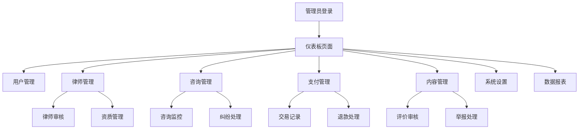

# 律师咨询网站管理员面板产品需求文档

## 1. 产品概述

管理员面板是律师咨询网站的后台管理系统，为网站管理员提供全面的数据管理、用户管理、内容审核和系统监控功能。通过直观的仪表板界面，管理员可以高效地管理平台运营，确保服务质量和用户体验。

## 2. 核心功能

### 2.1 用户角色

| 角色    | 登录方式    | 核心权限                       |
| ----- | ------- | -------------------------- |
| 超级管理员 | 邮箱+密码登录 | 拥有所有功能权限，包括系统设置和管理员账户管理    |
| 普通管理员 | 邮箱+密码登录 | 用户管理、律师审核、咨询监控、数据查看等日常运营权限 |
| 客服管理员 | 邮箱+密码登录 | 咨询处理、用户支持、投诉处理等客服相关权限      |

### 2.2 功能模块

管理员面板包含以下核心页面：

1. **仪表板页面**：数据概览、实时统计、快捷操作入口
2. **用户管理页面**：用户列表、用户详情、状态管理、权限设置
3. **律师管理页面**：律师审核、资质验证、状态管理、业绩统计
4. **咨询管理页面**：咨询监控、状态跟踪、纠纷处理、质量评估
5. **支付管理页面**：交易记录、退款处理、财务统计、对账管理
6. **内容管理页面**：评价审核、举报处理、内容监管
7. **系统设置页面**：平台配置、通知设置、权限管理
8. **数据报表页面**：业务报表、用户分析、收入统计、趋势分析

### 2.3 页面详情

| 页面名称   | 模块名称   | 功能描述                        |
| ------ | ------ | --------------------------- |
| 仪表板页面  | 数据概览卡片 | 显示用户总数、律师总数、今日咨询数、今日收入等关键指标 |
| 仪表板页面  | 实时图表   | 展示咨询趋势图、收入趋势图、用户增长图等可视化数据   |
| 仪表板页面  | 快捷操作   | 提供待审核律师、待处理投诉、系统通知等快捷入口     |
| 用户管理页面 | 用户列表   | 分页展示所有用户，支持搜索、筛选、排序功能       |
| 用户管理页面 | 用户详情   | 查看用户基本信息、咨询历史、支付记录、行为日志     |
| 用户管理页面 | 状态管理   | 启用/禁用用户账户、设置用户标签、发送通知       |
| 律师管理页面 | 律师审核   | 审核律师注册申请、验证资质证书、批准/拒绝申请     |
| 律师管理页面 | 资质管理   | 管理律师执业证书、专业认证、继续教育记录        |
| 律师管理页面 | 业绩统计   | 查看律师咨询数量、评分统计、收入报表          |
| 咨询管理页面 | 咨询监控   | 实时监控进行中的咨询、查看咨询详情、介入处理      |
| 咨询管理页面 | 纠纷处理   | 处理用户投诉、调解纠纷、执行退款决定          |
| 咨询管理页面 | 质量评估   | 抽查咨询质量、评估律师服务、生成质量报告        |
| 支付管理页面 | 交易记录   | 查看所有支付记录、交易详情、支付状态          |
| 支付管理页面 | 退款处理   | 处理退款申请、执行退款操作、记录退款原因        |
| 支付管理页面 | 财务统计   | 生成收入报表、计算平台佣金、统计律师收入        |
| 内容管理页面 | 评价审核   | 审核用户评价内容、处理恶意评价、维护评价质量      |
| 内容管理页面 | 举报处理   | 处理用户举报、调查违规行为、执行处罚措施        |
| 系统设置页面 | 平台配置   | 设置平台参数、费率配置、服务条款更新          |
| 系统设置页面 | 权限管理   | 管理管理员权限、角色分配、访问控制           |
| 数据报表页面 | 业务报表   | 生成日/周/月业务报表、导出数据、趋势分析       |
| 数据报表页面 | 用户分析   | 分析用户行为、用户画像、留存率统计           |

## 3. 核心流程

### 管理员操作流程

管理员登录后，首先进入仪表板查看平台整体运营状况。根据待处理事项，可以进入相应的管理模块进行操作。主要工作流程包括：律师审核流程、用户投诉处理流程、支付纠纷处理流程、内容审核流程等。



## 4. 用户界面设计

### 4.1 设计风格

* **主色调**：深蓝色(#1e40af)作为主色，浅蓝色(#3b82f6)作为辅助色

* **按钮样式**：圆角矩形按钮，主要按钮使用蓝色背景，次要按钮使用白色背景+蓝色边框

* **字体**：系统默认字体，标题使用16-20px，正文使用14px，小字使用12px

* **布局风格**：左侧导航栏+顶部面包屑+主内容区域的经典后台布局

* **图标风格**：使用Lucide图标库，线性风格，保持一致性

### 4.2 页面设计概览

| 页面名称   | 模块名称   | UI元素                              |
| ------ | ------ | --------------------------------- |
| 仪表板页面  | 数据概览卡片 | 白色卡片背景，蓝色数字显示，图标+标题+数值的布局，hover效果 |
| 仪表板页面  | 实时图表   | Chart.js图表组件，响应式设计，支持时间范围选择       |
| 用户管理页面 | 用户列表   | 数据表格，分页器，搜索框，筛选下拉菜单，操作按钮          |
| 用户管理页面 | 用户详情   | 模态框或侧边栏，标签页切换，信息卡片布局              |
| 律师管理页面 | 律师审核   | 审核队列列表，详情查看，批准/拒绝按钮，备注输入框         |
| 咨询管理页面 | 咨询监控   | 实时状态指示器，咨询详情面板，操作工具栏              |
| 支付管理页面 | 交易记录   | 数据表格，状态标签，金额高亮显示，导出功能             |
| 系统设置页面 | 配置表单   | 表单组件，开关按钮，数值输入框，保存确认              |

### 4.3 响应式设计

管理员面板采用桌面优先的设计策略，主要针对1200px以上的桌面屏幕优化。在平板设备(768px-1200px)上，侧边栏可折叠，表格支持横向滚动。移动设备访问时显示简化版界面，仅保留核心功能。

## 5. 权限控制要求

### 5.1 角色权限矩阵

| 功能模块  | 超级管理员 | 普通管理员 | 客服管理员 |
| ----- | ----- | ----- | ----- |
| 仪表板查看 | ✅     | ✅     | ✅     |
| 用户管理  | ✅     | ✅     | ❌     |
| 律师审核  | ✅     | ✅     | ❌     |
| 咨询监控  | ✅     | ✅     | ✅     |
| 支付管理  | ✅     | ✅     | ❌     |
| 内容审核  | ✅     | ✅     | ✅     |
| 系统设置  | ✅     | ❌     | ❌     |
| 数据报表  | ✅     | ✅     | ❌     |
| 管理员管理 | ✅     | ❌     | ❌     |

### 5.2 数据访问控制

* **数据隔离**：不同角色只能访问授权范围内的数据

* **操作日志**：记录所有管理员操作，包括时间、操作者、操作内容

* **敏感信息保护**：用户密码、支付信息等敏感数据加密存储，管理员无法直接查看

* **会话管理**：管理员会话超时自动登出，支持单点登录控制

## 6. 技术实现方案

### 6.1 前端技术栈

* **框架**：React 18 + TypeScript

* **UI组件库**：Tailwind CSS + Headless UI

* **图表库**：Chart.js + react-chartjs-2

* **状态管理**：Zustand

* **路由**：React Router v6

* **HTTP客户端**：Axios

* **表单处理**：React Hook Form

* **数据表格**：TanStack Table

### 6.2 后端API设计

管理员面板将复用现有的后端API，并扩展以下新接口：

```
# 仪表板统计
GET /api/admin/dashboard/stats
GET /api/admin/dashboard/charts

# 用户管理
GET /api/admin/users
GET /api/admin/users/:id
PUT /api/admin/users/:id/status
DELETE /api/admin/users/:id

# 律师管理
GET /api/admin/lawyers
PUT /api/admin/lawyers/:id/verify
GET /api/admin/lawyers/:id/stats

# 咨询管理
GET /api/admin/consultations
PUT /api/admin/consultations/:id/status
POST /api/admin/consultations/:id/intervene

# 支付管理
GET /api/admin/payments
POST /api/admin/payments/:id/refund
GET /api/admin/payments/reports

# 系统管理
GET /api/admin/system/logs
PUT /api/admin/system/settings
GET /api/admin/system/health
```

### 6.3 数据库扩展

需要在现有数据库基础上添加以下表：

```sql
-- 管理员表
CREATE TABLE admins (
  id UUID PRIMARY KEY DEFAULT gen_random_uuid(),
  user_id UUID REFERENCES users(id),
  role VARCHAR(20) DEFAULT 'admin',
  permissions JSONB DEFAULT '{}',
  last_login TIMESTAMP,
  created_at TIMESTAMP DEFAULT CURRENT_TIMESTAMP
);

-- 操作日志表
CREATE TABLE admin_logs (
  id UUID PRIMARY KEY DEFAULT gen_random_uuid(),
  admin_id UUID REFERENCES admins(id),
  action VARCHAR(100) NOT NULL,
  target_type VARCHAR(50),
  target_id UUID,
  details JSONB,
  ip_address INET,
  created_at TIMESTAMP DEFAULT CURRENT_TIMESTAMP
);

-- 系统设置表
CREATE TABLE system_settings (
  id UUID PRIMARY KEY DEFAULT gen_random_uuid(),
  key VARCHAR(100) UNIQUE NOT NULL,
  value JSONB NOT NULL,
  description TEXT,
  updated_by UUID REFERENCES admins(id),
  updated_at TIMESTAMP DEFAULT CURRENT_TIMESTAMP
);
```

### 6.4 安全措施

* **身份认证**：JWT token认证，token有效期2小时

* **权限验证**：基于角色的访问控制(RBAC)

* **API限流**：管理员API请求限制为每分钟100次

* **数据加密**：敏感数据使用AES-256加密

* **审计日志**：所有管理操作记录到audit\_logs表

* **HTTPS强制**：生产环境强制使用HTTPS协议

### 6.5 部署方案

* **前端部署**：Vercel静态部署，支持自动构建和CDN加速

* **后端部署**：现有Node.js服务扩展，无需额外部署

* **数据库**：使用现有PostgreSQL数据库

* **监控**：集成应用性能监控(APM)和错误追踪

* **备份**：数据库每日自动备份，保留30天历史数据

